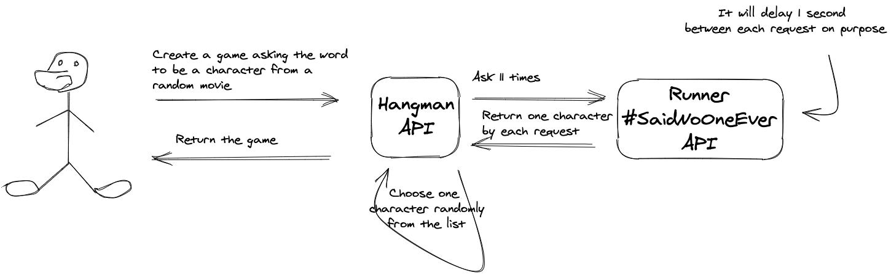

# Runner [#SaidNoOneEver](https://twitter.com/hashtag/SaidNoOneEver?src=hashtag_click)

Find a movie or a character from it and this API will reply to you as soon as possible #SaidNoOneEver.

## Running it

Run NOW through the command:

    docker run --rm -it --name runner-said-no-one-ever \
    -e PUMA_BIND_ADDRESS=0.0.0.0 \
    -e PUMA_BIND_PORT=8080 \
    -e PUMA_MIN_THREADS=4 \
    -e PUMA_MAX_THREADS=20 \
    -e PUMA_NUMBER_OF_WORKERS=0 \
    -e PUMA_PERSISTENT_TIMEOUT=20 \
    -e PUMA_FIRST_DATA_TIMEOUT=30 \
    -e RACK_ENV=production \
    -e APP_ENV=production \
    -e PROJECT_LOG_LEVEL=DEBUG \
    -e RACK_IP_ADDRESS_HEADER=REMOTE_ADDR \
    -p 8000:8080 \
    willianantunes/runner-said-no-one-ever

If you download the project just issue:

    docker-compose up app

And with `HTTPie`:

    http GET :8000/api/v1/deckard-cain name==Cockatiel
    http GET :8000/api/v1/movies

In order to log as JSON, change `APP_ENV` and `RACK_ENV` value to `production` instead of `development` and run the project again! If you leave as the standard and consult movies endpoint:

```text
app_1    | Puma starting in single mode...
app_1    | * Version 5.0.0 (ruby 2.7.1-p83), codename: Spoony Bard
app_1    | * Min threads: 4, max threads: 20
app_1    | * Environment: development
app_1    | * Listening on http://0.0.0.0:8080
app_1    | Use Ctrl-C to stop
app_1    | I, [2020-09-26T20:45:06.062309 #6]  INFO -- Controllers::API::V1::MoviesController: Asking film specialist...
app_1    | D, [2020-09-26T20:45:06.062394 #6] DEBUG -- Business::FilmSpecialist: Consulting movies warehouse...
app_1    | I, [2020-09-26T20:45:06.913184 #6]  INFO -- Controllers::API::V1::MoviesController: Sleeping the following number of seconds: 1
app_1    | D, [2020-09-26T20:45:07.918926 #6] DEBUG -- Controllers::API::V1::MoviesController: Character and movie: Miracle Max / PrincessBride
app_1    | 172.25.0.1 - - [26/Sep/2020:20:45:07 +0000] "GET /api/v1/movies?greg=mygod&aaaaa=bb HTTP/1.1" 200 51 1.8644
```

Now as `production`:

```text
app_1    | {"registered_at":"2020-09-26T20:48:55.182+00:00","pid":7,"thread_id":3380,"message":"Puma starting in single mode..."}
app_1    | {"registered_at":"2020-09-26T20:48:55.182+00:00","pid":7,"thread_id":3380,"message":"* Version 5.0.0 (ruby 2.7.1-p83), codename: Spoony Bard"}
app_1    | {"registered_at":"2020-09-26T20:48:55.182+00:00","pid":7,"thread_id":3380,"message":"* Min threads: 4, max threads: 20"}
app_1    | {"registered_at":"2020-09-26T20:48:55.182+00:00","pid":7,"thread_id":3380,"message":"* Environment: production"}
app_1    | {"registered_at":"2020-09-26T20:48:55.464+00:00","pid":7,"thread_id":3380,"message":"* Listening on http://0.0.0.0:8080"}
app_1    | {"registered_at":"2020-09-26T20:48:55.464+00:00","pid":7,"thread_id":3380,"message":"Use Ctrl-C to stop"}
app_1    | {"level":"INFO","prog_name":"Controllers::API::V1::MoviesController","pid":7,"thread_id":3720,"registered_at":"2020-09-26T20:48:57.928+00:00","message":"Asking film specialist..."}
app_1    | {"level":"DEBUG","prog_name":"Business::FilmSpecialist","pid":7,"thread_id":3720,"registered_at":"2020-09-26T20:48:57.928+00:00","message":"Consulting movies warehouse..."}
app_1    | {"level":"INFO","prog_name":"Controllers::API::V1::MoviesController","pid":7,"thread_id":3720,"registered_at":"2020-09-26T20:48:58.805+00:00","message":"Sleeping the following number of seconds: 1"}
app_1    | {"level":"DEBUG","prog_name":"Controllers::API::V1::MoviesController","pid":7,"thread_id":3720,"registered_at":"2020-09-26T20:48:59.807+00:00","message":"Character and movie: Carc / Hobbit"}
app_1    | {"ip_address":"172.25.0.1","registered_at":"2020-09-26T20:48:59.814+00:00","pid":7,"thread_id":3720,"request_id":null,"method":"GET","path":"/api/v1/movies","query":"?greg=mygod&aaaaa=bb","version":"HTTP/1.1","status":"200","response_length":"37","referer":null,"user_agent":"HTTPie/2.2.0","request_time":1.8913743}
```

## Running all tests

Execute the following command:

    docker-compose up tests

And you'll see something like:

```
Finished in 0.96628 seconds (files took 0.43692 seconds to load)
5 examples, 0 failures
```

## Purpose

The idea here is to delay 1 second or more (given you custom configuration) to answer a request, thus you can use this behavior for interesting tests, like dispatching 10 requests from you back-end to this service and do it efficiently with some approaches like through [Threads](https://en.wikipedia.org/wiki/Thread_(computing)#Thread_and_fiber_issues) or [Coroutines](https://en.wikipedia.org/wiki/Coroutine). See this flow which I used for a [RoR project emulating a Hangman game through an API](https://github.com/willianantunes/hangman-ruby-playground/):



Why Sinatra? See more [here](https://www.ruby-toolbox.com/categories/web_app_frameworks). 

## Lessons learned

In order to create a project following Ruby conventions to organize a project, I executed the following command:

    bundle gem runner_said_no_one_ever --no-exe --no-coc --mit --test=rspec

After that, I deleted the following files:

```txt
runner_said_no_one_ever.gemspec
.travis.yml
bin
```

See more details [here](https://bundler.io/guides/creating_gem.html).

### Interesting links

Articles:

- [How to create a Ruby API with Sinatra](https://x-team.com/blog/how-to-create-a-ruby-api-with-sinatra/)
- [Where does bundler store gems?](https://stackoverflow.com/a/32638896/3899136)
- [Create a custom RuboCop action](https://www.jetbrains.com/help/ruby/rubocop.html#rubocop_external_tool)
- [Make Rubocop Part of Your Tests](https://blog.trueheart78.com/ruby/2016/09/18/make-rubocop-part-of-your-tests.html)
- [Structuring Sinatra Applications](https://nickcharlton.net/posts/structuring-sinatra-applications.html)
- [Bundler.setup vs. Bundler.require](https://anti-pattern.com/bundler-setup-vs-bundler-require)
- [Why is bad specific setup for development, test, production](https://12factor.net/config)
- [Rack Explained For Ruby Developers](https://www.rubyguides.com/2018/09/rack-middleware/)
- [Logging with Ruby Sinatra and Passenger](http://sundivenetworks.com/archive/2014/logging-with-sinatra-and-passenger.html)
- [The recommendation of structured logging and the reason I have made Ougai for Ruby](https://dev.to/tilfin/the-recommendation-of-structured-logging-and-the-reason-i-have-made-ougai-for-ruby-39pn)

Discussions:

- [What's the difference between RSpec's subject and let? When should they be used or not?](https://stackoverflow.com/a/38459039/3899136)

Some projects:

- [sckott/usdaplantsapi](https://github.com/sckott/usdaplantsapi)
- [sckott/cchecksapi](https://github.com/sckott/cchecksapi)
- [syxanash/gitron](https://github.com/syxanash/gitron)
- [kuntoaji/sinator](https://github.com/kuntoaji/sinator)
- [T-Dnzt/booklist](https://github.com/T-Dnzt/booklist)
- [nickcharlton/moviesapi](https://github.com/nickcharlton/moviesapi)
- [FunGoStudios/json-commonlogger](https://github.com/FunGoStudios/json-commonlogger)
- [kballenegger/rack-json-logs](https://github.com/kballenegger/rack-json-logs)
- [sinatra-logger](https://rubygems.org/gems/sinatra-logger/versions/0.3.2)
- [hx/rack-traffic-logger](https://github.com/hx/rack-traffic-logger)
- [tilfin/ougai](https://github.com/tilfin/ougai)
- [mainameiz/huyegger](https://github.com/mainameiz/huyegger)
- [thisismydesign/easy_logging](https://github.com/thisismydesign/easy_logging)
